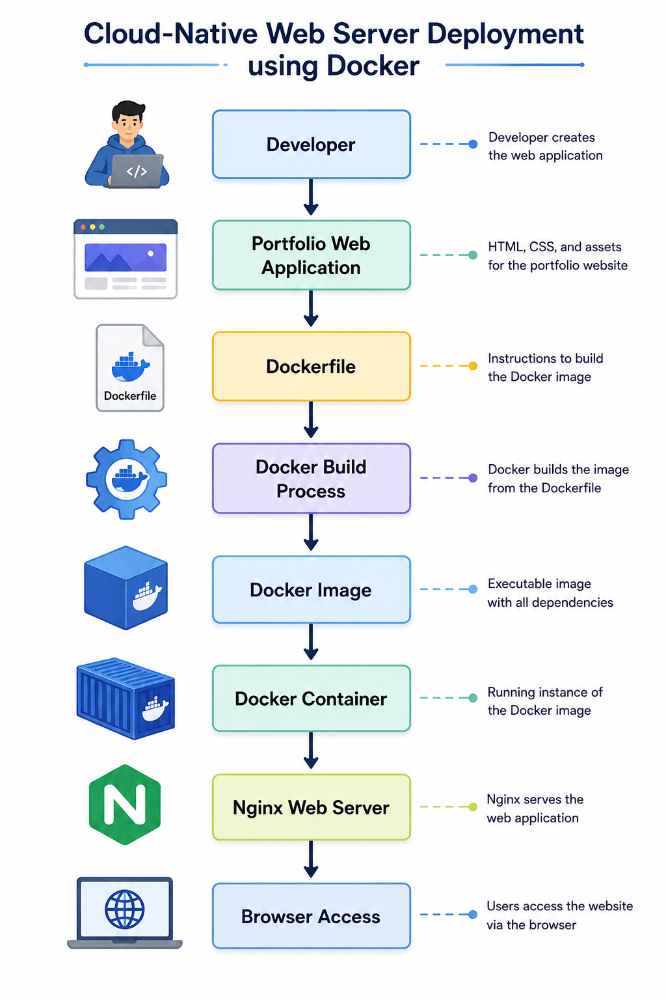
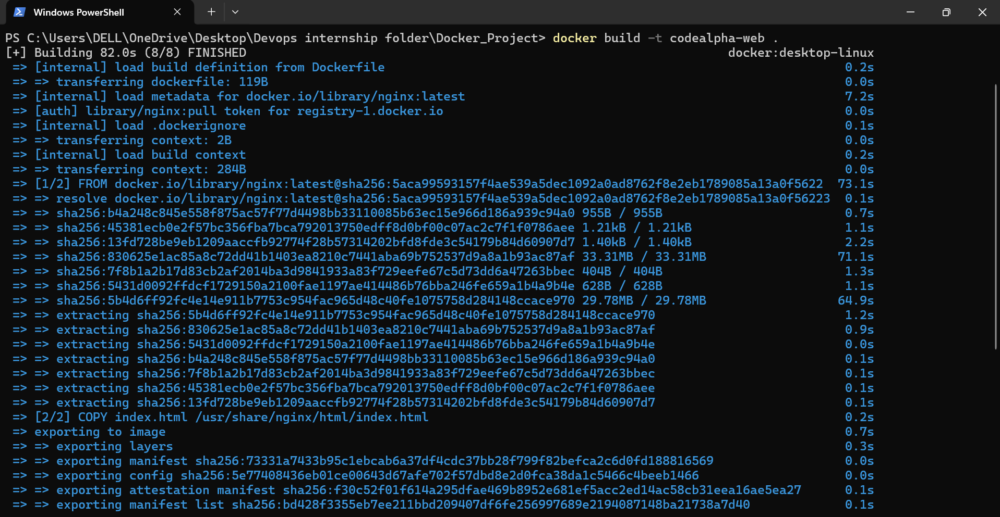
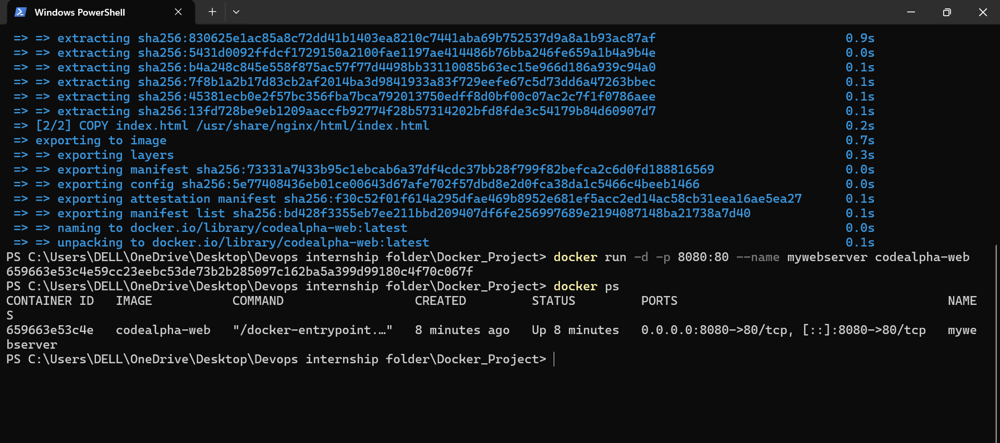
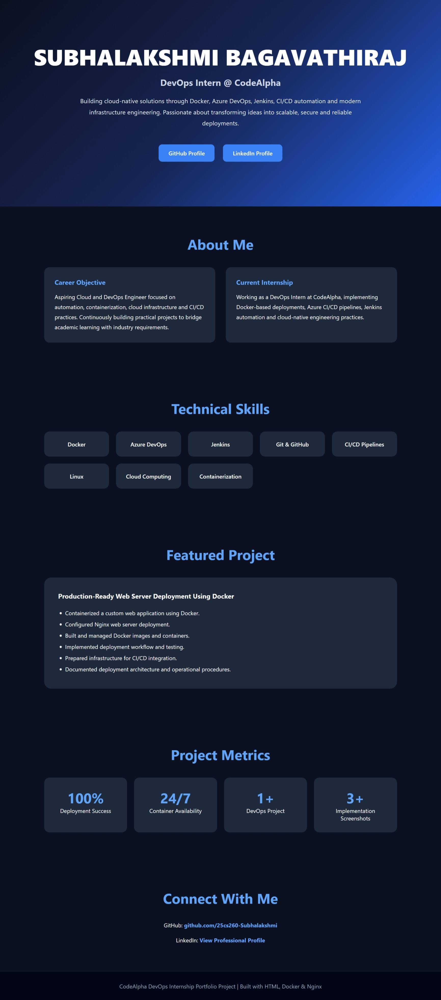

# Cloud-Native Web Server Deployment using Docker

> A production-inspired DevOps project demonstrating containerized web application deployment using Docker and Nginx, with automated health monitoring and deployment documentation.

---

# Developer

**Subhalakshmi Bagavathiraj**

DevOps Intern @ CodeAlpha

GitHub:  
https://github.com/25cs260-Subhalakshmi

LinkedIn:  
https://www.linkedin.com/in/subhalakshmi-bagavathiraj-862873386/

---

# Project Overview

Modern software deployment requires applications to be portable, reliable, and consistent across different environments. Traditional deployments often face dependency conflicts, configuration issues, and environment-specific failures.

This project demonstrates the deployment of a professional portfolio web application using Docker and Nginx. The application was containerized, packaged into a Docker image, deployed as a Docker container, and exposed through port mapping for browser access.

To improve operational reliability, Docker HEALTHCHECK functionality was implemented to continuously monitor application availability and verify service health.

This project reflects industry-standard DevOps practices and establishes a foundation for future CI/CD automation, cloud deployment, and scalable infrastructure management.

---

# Business Problem

Deploying applications directly on operating systems introduces several challenges:

- Environment inconsistencies
- Dependency conflicts
- Difficult deployment management
- Reduced portability
- Increased maintenance effort

Organizations require a deployment strategy that provides consistency, portability, reliability, and scalability.

---

# Solution

A containerized deployment architecture was designed using Docker and Nginx.

The solution provides:

- Consistent execution environments
- Simplified deployment workflows
- Improved portability
- Faster deployment cycles
- Automated service monitoring
- Foundation for CI/CD integration

---

# Objectives

- Understand Docker containerization concepts
- Build custom Docker images
- Deploy applications using containers
- Manage container lifecycle operations
- Implement health monitoring
- Gain practical DevOps experience
- Prepare infrastructure for future CI/CD automation

---

# Technologies Used

| Technology | Purpose |
|------------|----------|
| Docker | Containerization Platform |
| Nginx | Web Server |
| HTML | Frontend Development |
| CSS | User Interface Styling |
| GitHub | Version Control |
| Windows 11 | Development Environment |

---

# Architecture Diagram



---

# System Architecture

```text
Developer
    │
    ▼
Portfolio Web Application
    │
    ▼
Dockerfile
    │
    ▼
Docker Build Process
    │
    ▼
Docker Image
    │
    ▼
Docker Container
    │
    ▼
Nginx Web Server
    │
    ▼
Browser Access
```

---

# Project Structure

```text
CodeAlpha_WebServer_Docker/
│
├── Dockerfile
├── index.html
├── README.md
├── architecture.md
│
└── screenshots/
    ├── architecture.png
    ├── docker-build-success.png
    ├── docker-container-running.png
    └── portfolio-homepage.png
```

---

# Implementation Workflow

## Step 1 — Application Development

Developed a professional portfolio-style landing page using HTML and CSS.

## Step 2 — Containerization

Created a Dockerfile to package the application and deployment environment.

## Step 3 — Docker Image Creation

Built a reusable Docker image.

```bash
docker build -t codealpha-web .
```

## Step 4 — Container Deployment

Deployed the application as a Docker container.

```bash
docker run -d -p 8080:80 --name mywebserver codealpha-web
```

## Step 5 — Deployment Validation

Verified deployment and container availability.

```bash
docker ps
```

## Step 6 — Health Monitoring

Implemented Docker HEALTHCHECK functionality to automatically verify service availability.

---

# Features Implemented

- Containerized application deployment
- Docker image management
- Nginx web server integration
- Browser-accessible application hosting
- Container lifecycle management
- Docker HEALTHCHECK monitoring
- Professional portfolio landing page
- Technical documentation
- Deployment architecture documentation

---

# DevOps Highlights

- Implemented infrastructure consistency through containerization.
- Automated deployment packaging using Docker.
- Configured Nginx within a containerized environment.
- Added Docker HEALTHCHECK for proactive service monitoring.
- Managed image creation, deployment, validation, and troubleshooting.
- Created deployment documentation following engineering best practices.
- Established a deployment architecture ready for Azure DevOps and Jenkins integration.

---

# Technical Achievements

## Deployment Reliability

Successfully deployed the application in an isolated Docker environment, ensuring repeatable and predictable deployments.

## Service Monitoring

Integrated Docker HEALTHCHECK to continuously validate application availability and improve operational reliability.

## Environment Consistency

Packaged application code and runtime dependencies into a single containerized deployment unit.

## DevOps Alignment

Applied modern DevOps deployment practices commonly used in cloud-native environments.

---

# Project Results

The project successfully demonstrates:

- Docker image creation
- Container deployment and management
- Nginx web server hosting
- Automated service monitoring
- Browser-based application accessibility
- Container lifecycle management
- Practical DevOps workflow implementation

---

# Screenshots

## Docker Image Build



## Running Docker Container



## Portfolio Landing Page



---

# Skills Demonstrated

- Docker
- Nginx
- Containerization
- Deployment Automation
- Service Monitoring
- Infrastructure Management
- Technical Documentation
- DevOps Fundamentals
- GitHub Project Management

---

# Learning Outcomes

Through this project, practical experience was gained in:

- Docker containerization
- Application deployment workflows
- Container lifecycle management
- Nginx configuration
- Service health monitoring
- Deployment validation
- Infrastructure consistency
- Modern DevOps practices

This implementation strengthened understanding of cloud-native deployment principles and established a foundation for advanced DevOps technologies such as Azure DevOps, Jenkins, Kubernetes, and Infrastructure as Code.

---

# Future Enhancements

Planned improvements include:

- Azure DevOps CI/CD Pipeline
- Azure Container Registry Integration
- Azure App Service Deployment
- Jenkins Automation
- Kubernetes Deployment
- Monitoring and Logging Dashboard
- Automated Release Workflows
- Cloud-Native Infrastructure Expansion

---

# Conclusion

This project successfully demonstrates the deployment of a containerized web application using Docker and Nginx while applying core DevOps principles such as containerization, deployment automation, service monitoring, and infrastructure consistency.

Beyond technical implementation, the project emphasizes engineering discipline through documentation, architecture design, deployment validation, and operational readiness. The resulting solution establishes a strong foundation for future cloud-native deployments, CI/CD automation, and scalable infrastructure management.

---

# Author

**Subhalakshmi Bagavathiraj**

DevOps Intern @ CodeAlpha

CodeAlpha DevOps Internship Project – 2026
