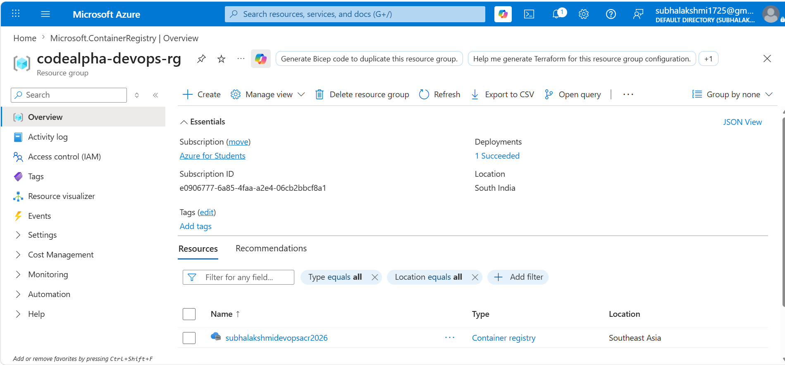
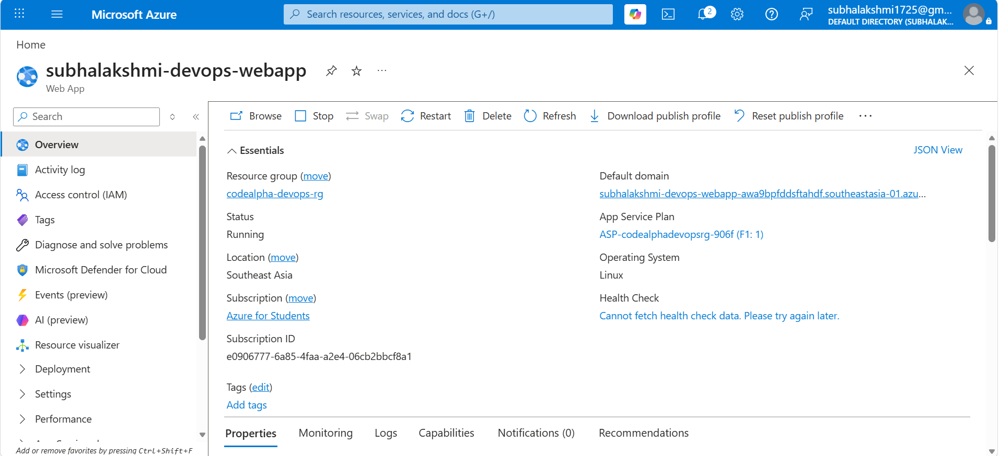
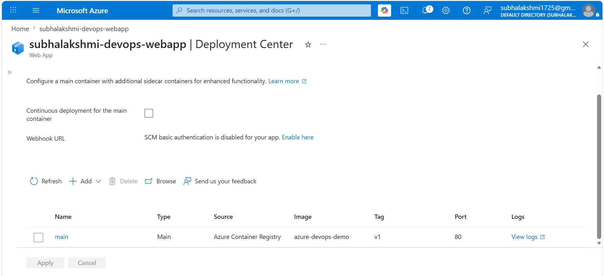
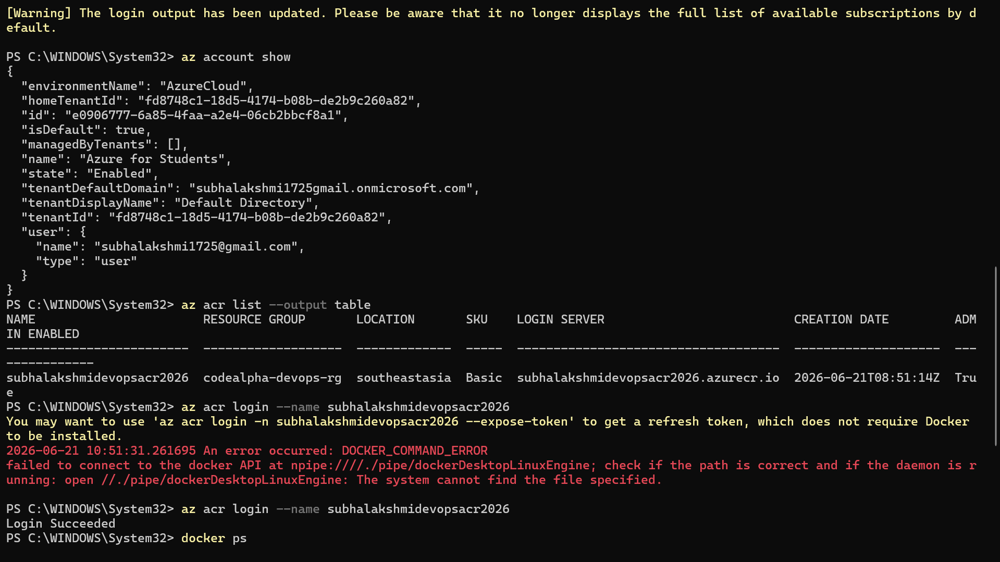
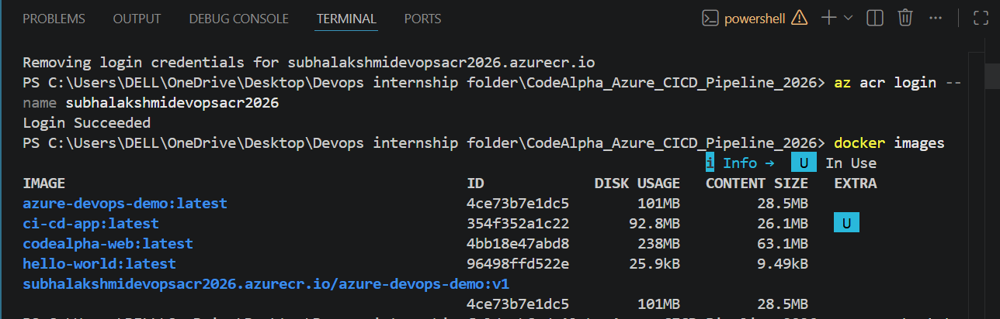
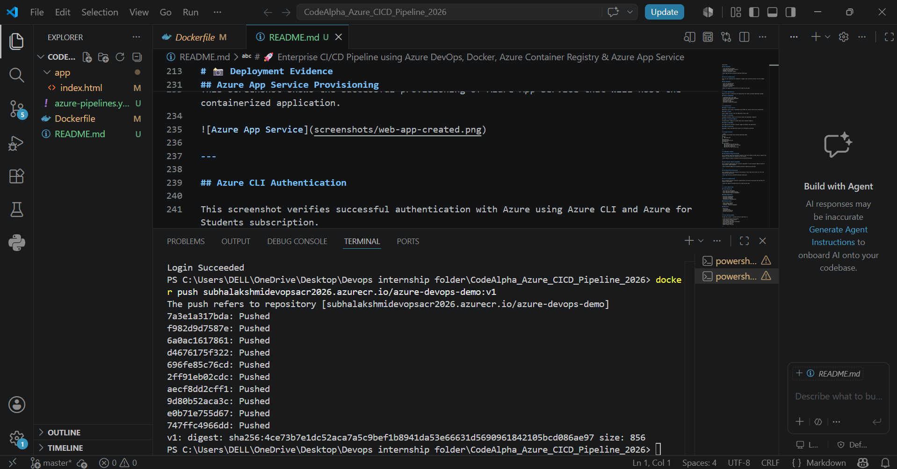
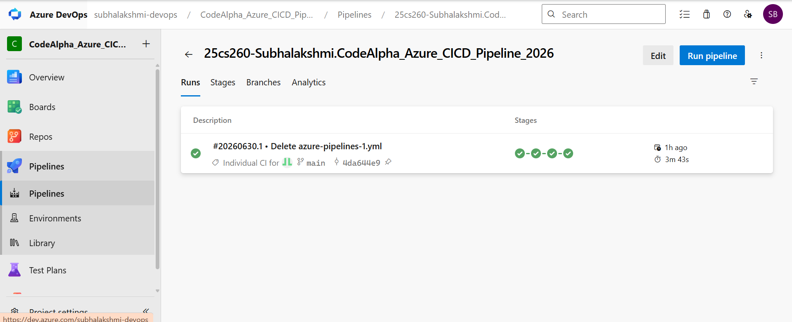
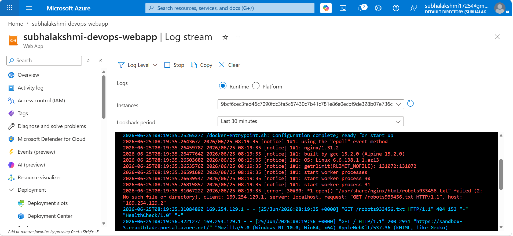
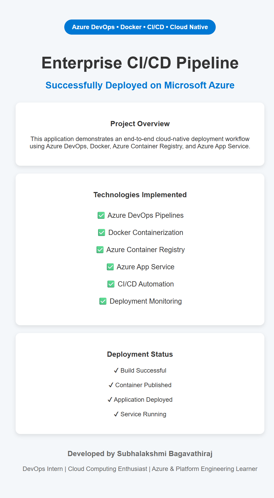

# 🚀 Enterprise CI/CD Pipeline using Azure DevOps, Docker, Azure Container Registry & Azure App Service

<p align="center">
  
  
  
  
</p>

---

# 📌 Project Overview

This project implements a cloud-native Continuous Integration and Continuous Deployment (CI/CD) workflow using Microsoft Azure DevOps Pipelines, Docker containerization, Azure Container Registry, and Azure App Service.

A push to the `main` branch automatically triggers an Azure Pipeline that builds a Docker image, pushes it to Azure Container Registry, deploys it to Azure App Service, and runs a post-deployment health check — with no manual steps required.

---

# 🎯 Project Objectives

- Implement an automated CI/CD workflow using Azure Pipelines
- Build and store Docker images in Azure Container Registry
- Automatically deploy containerized applications to Azure App Service
- Monitor pipeline execution to ensure smooth, reliable delivery
- Strengthen Azure and DevOps engineering skills

---

# 🏗️ Solution Architecture

```text
Developer
    │
    ▼
GitHub Repository (main branch)
    │
    ▼  (push triggers pipeline automatically)
Azure Pipeline
    │
    ├── Build Stage      → docker build + push to ACR
    ├── Validation Stage → confirm image pushed successfully
    ├── Deploy Stage      → AzureWebAppContainer task deploys to App Service
    └── Monitor Stage     → curl health check on live URL
    │
    ▼
Azure Container Registry (subhalakshmidevopsacr2026)
    │
    ▼
Azure App Service (subhalakshmi-devops-webapp)
    │
    ▼
Live Web Application
```

---

# ⚙️ Technology Stack

| Technology | Purpose |
|------------|----------|
| Azure DevOps Pipelines | CI/CD Automation |
| Docker | Containerization |
| Azure Container Registry | Container Image Storage |
| Azure App Service | Application Hosting |
| Azure CLI | Resource Management |
| GitHub | Version Control |
| Nginx | Web Server |
| Linux | Runtime Environment |

---

# ☁️ Azure Infrastructure Provisioning

## Azure Resource Group

A dedicated Resource Group (`codealpha-devops-rg`) was provisioned to centrally manage all cloud resources used in this project, deployed under the Azure for Students subscription in the Southeast Asia / South India region.



---

## Azure Container Registry (ACR)

Azure Container Registry was provisioned to securely store and version Docker container images built by the pipeline.

**Registry Name:** `subhalakshmidevopsacr2026`
**Login Server:** `subhalakshmidevopsacr2026.azurecr.io`


---

## Azure App Service

A Linux-based Azure App Service (`subhalakshmi-devops-webapp`) was provisioned to host the containerized web application, configured to pull its container image from Azure Container Registry.





---

## Azure CLI Authentication

Azure CLI was used to authenticate and manage cloud resources directly from the command line during initial setup and verification.




---

# 🐳 Docker Implementation

The application is packaged using a lightweight Nginx Alpine base image, with a built-in container health check.





### Features Implemented

- Lightweight Nginx Alpine base image
- Static web content served on port 80
- Built-in Docker `HEALTHCHECK` instruction
- Versioned, tagged image pushes to ACR

---

# 🔄 CI/CD Pipeline — Automated Workflow

The pipeline is defined in `azure-pipelines.yml` and runs automatically on every push to `main`. It consists of four stages:

### Stage 1 — Build
Builds the Docker image from the `Dockerfile` and pushes it directly to Azure Container Registry, tagged with the unique Azure DevOps build ID.

### Stage 2 — Validation
Confirms the image was built and pushed successfully before allowing the pipeline to proceed to deployment.

### Stage 3 — Deploy
Uses the `AzureWebAppContainer@1` task to automatically deploy the newly pushed container image from ACR to Azure App Service — no manual portal steps required.

### Stage 4 — Monitor
Performs a post-deployment HTTP health check against the live application URL and logs a warning in the pipeline if the app does not return a 200 status, giving visibility into deployment success or failure.




---

# 📊 Monitoring

In addition to the pipeline's built-in health check stage, the live App Service log stream was used to verify the application is serving requests correctly at runtime.



---

# 🌐 Live Application



---

# 📁 Project Structure

```text
CodeAlpha_Azure_DevOps_CICD_Container_Deployment_2026
│
├── app
│   └── index.html
│
├── Dockerfile
├── azure-pipelines.yml
├── README.md
│
└── screenshots
    ├── resource-group-overview.png
    ├── container-registry-overview.png
    ├── web-app-overview.png
    ├── container-configuration.png
    ├── azure-cli-login_start.png
    ├── azure-cli-logged-in.png
    ├── docker-image-built.png
    ├── image-pushed-to-acr.png
    ├── successful-deployment-logs.png
    ├── live-application.png
    ├── automatic-trigger-proof.png
    └── pipeline-run-overview.png
```

---

# 🎓 Skills Demonstrated

### Cloud Engineering
- Azure Resource Management
- Azure App Service Administration
- Azure Container Registry Management

### DevOps Engineering
- Azure Pipelines (multi-stage YAML pipelines)
- Continuous Integration & Continuous Deployment
- Service Connections (Docker Registry, Azure Resource Manager)
- Deployment Automation

### Containerization
- Docker Image Creation
- Container Image Versioning and Tagging
- Container Deployment to PaaS

### Operations
- Pipeline Monitoring
- Automated Health Checks
- Deployment Validation

---

# 📈 Key Learning Outcomes

Through this project, I gained practical experience in:

- Building multi-stage YAML pipelines in Azure DevOps
- Configuring service connections to securely link Azure DevOps to ACR and Azure subscriptions
- Automating container builds, pushes, and deployments end-to-end
- Monitoring pipeline execution and verifying deployment health automatically
- Cloud infrastructure provisioning and resource management in Azure

---

# 🔮 Future Enhancements

- Infrastructure as Code using Terraform or Bicep
- Kubernetes deployment using AKS
- Blue-Green / Canary deployments
- Azure Monitor alerts and Application Insights integration

---

# 📄 Conclusion

This project demonstrates a complete, automated cloud-native CI/CD workflow: a push to `main` triggers an Azure Pipeline that builds a Docker image, pushes it to Azure Container Registry, deploys it automatically to Azure App Service, and verifies the deployment with an automated health check — combining Azure DevOps, Docker, ACR, and App Service into a single automated delivery pipeline.

---

# 👩‍💻 Author

**Subhalakshmi Bagavathiraj**

DevOps Intern @ CodeAlpha

☁️ Cloud Computing Enthusiast
⚙️ DevOps Learner
🚀 Aspiring Cloud & Platform Engineer
